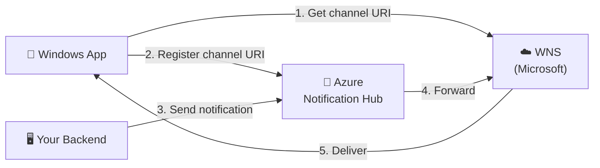

# WNS + Azure Notification Hubs — Push Notifications for Windows Apps

This repository is a complete, beginner‑friendly guide and working sample for sending
**push notifications** to a Windows (UWP) application using **Windows Push Notification
Service (WNS)** and **Azure Notification Hubs**.

It is based on the official Microsoft tutorial:
[Send notifications to Universal Windows Platform apps using Azure Notification Hubs](https://learn.microsoft.com/en-us/azure/notification-hubs/notification-hubs-windows-store-dotnet-get-started-wns-push-notification).

---

## What's inside

| Path | What it is |
| --- | --- |
| [docs/01-concepts.md](docs/01-concepts.md) | Plain‑English explanation of Notification Hubs & WNS, and how they work together. |
| [docs/02-architecture.md](docs/02-architecture.md) | Architecture diagrams (request flow + components). |
| [docs/03-setup-guide.md](docs/03-setup-guide.md) | Step‑by‑step: create a Notification Hub, configure WNS, and wire it up. |
| [docs/04-test-and-publish.md](docs/04-test-and-publish.md) | Test end‑to‑end, host the sender on Azure App Service, and publish the app to the Store. |
| [samples/UwpClientApp](samples/UwpClientApp) | The Windows (UWP) client that **receives** notifications. |
| [samples/BackendSender](samples/BackendSender) | A .NET console app that **sends** a notification (simplest sender). |
| [samples/BackendApi](samples/BackendApi) | An ASP.NET Core Web API that sends notifications over HTTP — deploy to **App Service**. |

---

## The 30‑second version

1. Your **app** asks **WNS** for a unique address (a *channel URI*).
2. The app **registers** that address with your **Azure Notification Hub**.
3. Your **backend** tells the **hub** "send this message."
4. The hub forwards it to **WNS**.
5. **WNS** delivers the notification to the device. 🎉

You never have to talk to WNS directly from your backend — the **Notification Hub does it
for you**, and it can fan out the same message to millions of devices across iOS, Android,
and Windows.

---

## Quick start

1. Read [docs/01-concepts.md](docs/01-concepts.md) to understand the moving parts.
2. Follow [docs/03-setup-guide.md](docs/03-setup-guide.md) to create the Azure resources.
3. Run the [client app](samples/UwpClientApp) to register a device.
4. Run the [backend sender](samples/BackendSender) to push a notification.
5. Test end‑to‑end and go to production with [docs/04-test-and-publish.md](docs/04-test-and-publish.md).

---

## Your Azure context

Fill these in for your own environment. **Do not commit real secrets or IDs** — see
[`.gitignore`](.gitignore) and use the placeholder config files.

| Setting | Value |
| --- | --- |
| Tenant ID | `<your-tenant-id>` |
| Subscription ID | `<your-subscription-id>` |
| Owner / Admin | `<your-admin-account>` |

> ⚠️ **Note on "mobile application":** WNS targets **Windows** apps (desktop/UWP). If your
> mobile app is **iOS** or **Android**, Notification Hubs still works the same way — you'd
> just swap WNS for **APNS** (Apple) or **FCM** (Google). The hub abstraction is identical.
> See the note at the end of [docs/01-concepts.md](docs/01-concepts.md).
