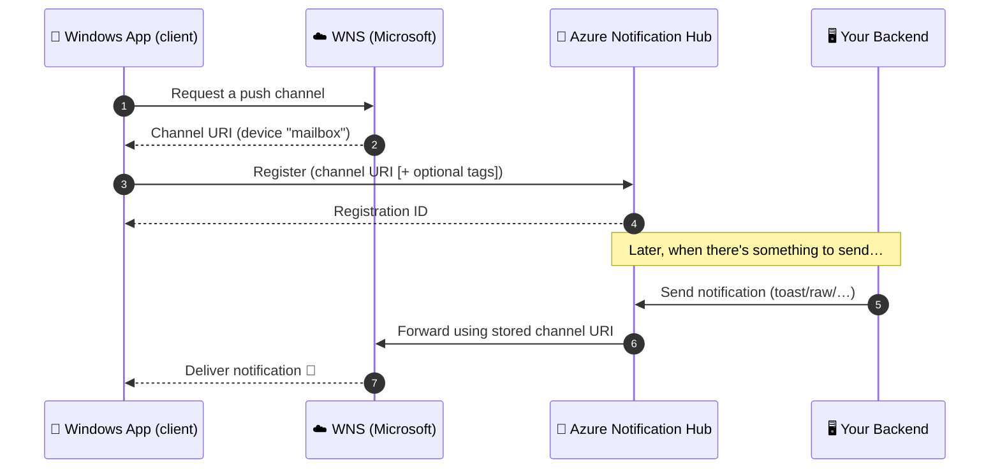

# 1. Concepts — Notification Hubs & WNS in plain English

This page explains, with no prior knowledge assumed, **what** these services are, **why**
they exist, and **how** they work together.

---

## The problem they solve

You want your app to show a notification ("You have a new message!") even when the app is
**closed**. An app that is not running cannot check for updates by itself. So who wakes it up?

The answer is a **Platform Notification Service (PNS)** — a service run by the operating
system vendor that is *always* connected to every device. Your backend hands a message to
the PNS, and the PNS pushes it down to the device.

Each platform has its own PNS:

| Platform | PNS (Platform Notification Service) |
| --- | --- |
| **Windows** | **WNS** — Windows Push Notification Service |
| Apple (iOS/macOS) | APNS — Apple Push Notification service |
| Android / Google | FCM — Firebase Cloud Messaging |

---

## What is WNS?

**WNS (Windows Push Notification Service)** is Microsoft's PNS for Windows apps. It is the
infrastructure that actually **delivers** push notifications to a Windows device.

WNS can deliver four kinds of notifications:

| Type | What it does |
| --- | --- |
| **Toast** | A pop‑up notification in the corner of the screen (the most common one). |
| **Tile** | Updates the app's Live Tile on the Start menu. |
| **Badge** | Shows a number/glyph overlay on the tile (e.g. unread count). |
| **Raw** | A custom data payload delivered straight to your app's code. |

**How an app uses WNS directly:**
1. The app calls Windows and asks for a **channel URI** — a unique, temporary web address
   that represents "this app on this device." Think of it as a mailbox address.
2. The app sends that channel URI to *your* backend.
3. Your backend POSTs a notification to that channel URI (after authenticating with WNS
   using a **Package SID** and **client secret**).
4. WNS delivers it to the device.

This works, but it has pain points 👇

---

## Why add Azure Notification Hubs?

If you talk to WNS (and APNS, and FCM) directly, **your backend** has to:

- Store and manage **millions** of channel URIs / device tokens (they expire and change).
- Implement a **different protocol** for every platform (WNS, APNS, FCM all differ).
- Handle **authentication** with each PNS.
- **Throttle / batch** sends so you don't get rate‑limited.
- Manage **per‑user / per‑group targeting** (tags), localization, scheduling, etc.

**Azure Notification Hubs** is a managed service that does *all of that for you*. It sits
between your backend and the PNSs:

> Your backend talks to **one** API (the hub). The hub translates and delivers to **WNS,
> APNS, and FCM** on your behalf, to as many devices as you need.

Key features:

- **One API, every platform.** Send once; the hub fans out to Windows, iOS, and Android.
- **Device registration management.** The hub stores the channel URIs/tokens for you.
- **Tags.** Tag a registration (e.g. `user:1234`, `sports`, `en-US`) and send to just that
  audience.
- **Templates.** Define a payload shape once; the hub fills it per platform/language.
- **Massive scale.** Broadcast to millions of devices in minutes.

---

## How they work together (the flow)

**Plain words:**
1. The app gets its mailbox address (channel URI) from WNS.
2. The app drops that address into the hub (registration).
3. Your backend tells the hub "send this."
4. The hub looks up the address and forwards to WNS.
5. WNS delivers it to the device.

Your backend **never** needs to know about channel URIs or WNS — it only knows the hub.

---

## Key terms cheat‑sheet

| Term | Meaning |
| --- | --- |
| **PNS** | Platform Notification Service (WNS / APNS / FCM). |
| **WNS** | The Windows PNS. |
| **Channel URI** | The per‑device, per‑app address WNS gives you. Also called a *PNS handle*. |
| **Notification Hub** | The Azure service that manages registrations and fans out sends. |
| **Namespace** | A container that holds one or more notification hubs. |
| **Registration** | A device's channel URI (+ optional tags) stored in the hub. |
| **Tag** | A label on a registration used to target a subset of devices. |
| **Package SID** | Your app's WNS identity (from Partner Center). |
| **Client secret** | The password the hub uses to authenticate to WNS. |
| **DefaultListenSharedAccessSignature** | Connection string used by the **client** to register (listen‑only). |
| **DefaultFullSharedAccessSignature** | Connection string used by the **backend** to send. Keep it secret! |

---

## A note on "mobile" apps

WNS is for **Windows** apps specifically. If your real target is **iOS** or **Android**,
everything on this page still applies — you simply:

- Swap **WNS → APNS** (Apple) or **WNS → FCM** (Google) in the hub configuration.
- Use the matching client SDK to fetch the device token instead of a channel URI.

The hub, the registration model, tags, templates, and your backend code stay essentially
the same. That platform‑independence is the whole point of Notification Hubs.

➡️ Next: [02 — Architecture](02-architecture.md)
