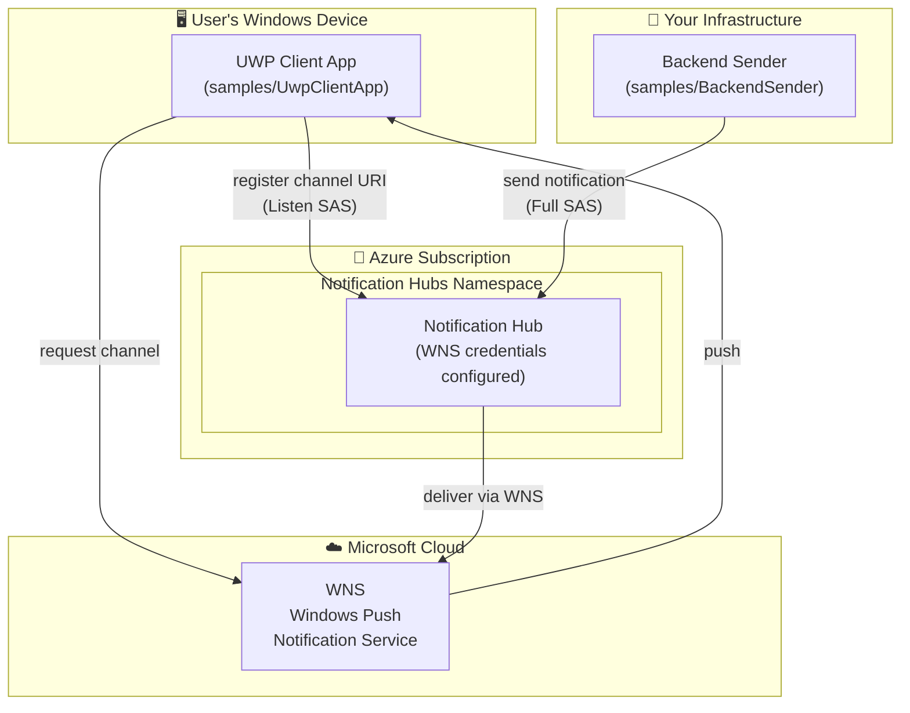
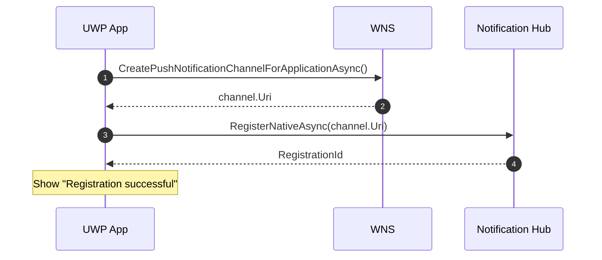
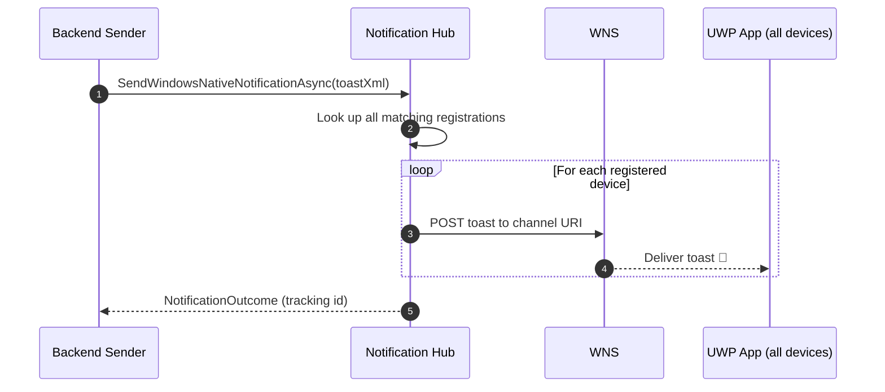
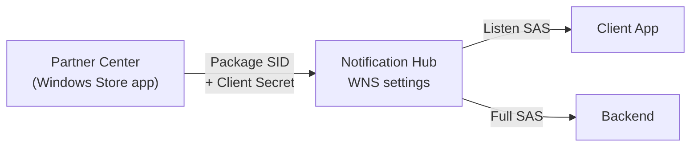

# 2. Architecture

This page shows the system from a few angles: the **components**, the **registration
flow**, and the **send flow**.

---

## Component diagram

---

## Registration flow (client side)

What happens when the **app starts up**:

> The client uses the **DefaultListenSharedAccessSignature** (listen‑only) connection
> string. It can register itself but cannot send notifications to others — least privilege.

---

## Send flow (backend side)

What happens when you want to **push a message**:

> The backend uses the **DefaultFullSharedAccessSignature** (full access) connection
> string. **Keep this secret** — never ship it inside the client app.

---

## Security & credentials map

| Credential | Where it lives | Who uses it | Secret? |
| --- | --- | --- | --- |
| Package SID + Client Secret | Hub → WNS settings | The hub (to auth to WNS) | ✅ Yes |
| Listen SAS connection string | Client app | Client (register only) | ⚠️ Low risk |
| Full SAS connection string | Backend only | Backend (send) | ✅ Yes — never in client |

➡️ Next: [03 — Setup guide](03-setup-guide.md)
